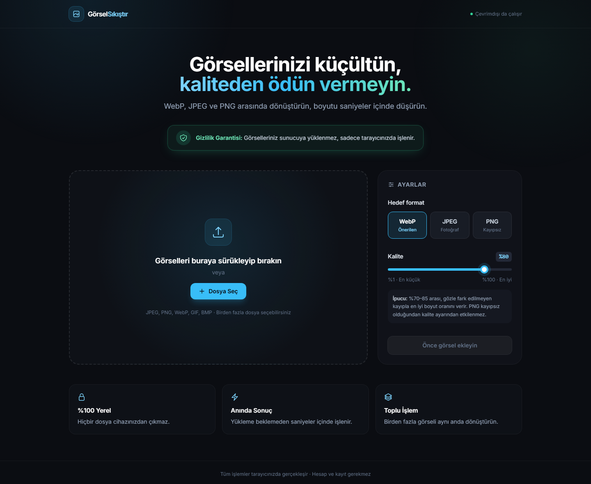

# 🖼️ Görsel Sıkıştırıcı ve Dönüştürücü

**Görsellerinizi tarayıcınızda sıkıştırın ve dönüştürün. Hiçbir dosya sunucuya yüklenmez.**


JPEG, PNG ve WebP görselleri saniyeler içinde küçülten, formatlar arasında dönüştüren, tarayıcı tabanlı bir araç. Tüm işlemler cihazınızda yapılır: hesap açmanız, dosya yüklemeniz veya bir sunucuya güvenmeniz gerekmez.

### 👉 [Canlı Demo](https://pietro379.github.io/gorsel-sikistirici/)



---

## 🔒 Gizlilik Garantisi

Çevrimiçi sıkıştırma araçlarının çoğu, görselinizi işlemek için kendi sunucularına yükler. Bu proje farklı çalışır:

| | Klasik çevrimiçi araçlar | Bu proje |
|---|---|---|
| Görsel nerede işlenir? | Uzak sunucuda | **Sizin tarayıcınızda** |
| Dosya internete gönderilir mi? | Evet | **Hayır** |
| Görsel sunucuda saklanır mı? | Çoğu zaman belirsiz | **Saklanacak bir sunucu yok** |
| Hesap / kayıt gerekir mi? | Sıklıkla | **Hayır** |
| İşlem süresi | Yükleme + işleme + indirme | **Yalnızca işleme** |

**Nasıl mümkün?** Görseller, tarayıcının yerleşik [FileReader](https://developer.mozilla.org/docs/Web/API/FileReader) ve [Canvas](https://developer.mozilla.org/docs/Web/API/Canvas_API) API'leri ile belleğe okunur ve yeniden kodlanır. Kodda `fetch`, `XMLHttpRequest` veya başka bir yükleme mekanizması yoktur. ZIP arşivi de [JSZip](https://stuk.github.io/jszip/) ile tarayıcıda oluşturulur.

### Kendiniz doğrulayın

Gizlilik iddiasını bize güvenmeden test edebilirsiniz:

1. Sayfayı açın ve **F12** ile geliştirici araçlarını açın.
2. **Network (Ağ)** sekmesine geçin.
3. Görselleri ekleyin, sıkıştırın ve indirin.
4. Listede görsellerinize ait **hiçbir giden istek** olmadığını göreceksiniz.

> **Not:** Sayfa ilk açılışta Tailwind CSS ve JSZip kütüphanelerini CDN üzerinden indirir. Bu istekler yalnızca kütüphane kodunu almak içindir; görselleriniz veya dosya bilgileriniz bu isteklere dahil edilmez.

---

## ✨ Özellikler

- **Format dönüştürme:** WebP, JPEG ve PNG arasında dönüştürme
- **Ayarlanabilir kalite:** %1–%100 arası slider; değişiklikler anında yansır
- **Toplu işlem:** Birden fazla görseli aynı anda yükleyip sıkıştırma
- **Sürükle-bırak:** Dosyaları doğrudan alana bırakma, belirgin görsel geri bildirim
- **Anlık karşılaştırma:** Her görsel için orijinal ve yeni boyut (KB/MB) ile kazanç yüzdesi
- **ZIP ile indirme:** Birden fazla görseli tek bir ZIP dosyası olarak indirme
- **Akıllı uyarılar:** Yeni dosya orijinalden büyük çıkarsa rozet sarıya döner
- **Şeffaflık desteği:** JPEG'e dönüştürürken şeffaf alanlar siyah yerine beyazla doldurulur
- **Format yedeği:** Tarayıcı WebP üretemiyorsa PNG'ye geçilir, uzantı buna göre verilir
- **Erişilebilirlik:** Klavye ile gezinme, odak göstergeleri ve `prefers-reduced-motion` desteği
- **Duyarlı tasarım:** Mobil, tablet ve masaüstünde düzgün görünen, koyu temalı arayüz

---

## 🚀 Kullanım

En hızlı yol: **[canlı demoyu](https://pietro379.github.io/gorsel-sikistirici/) açın.** Yerelde çalıştırmak için kurulum veya derleme adımı gerekmez:

```bash
git clone https://github.com/pietro379/gorsel-sikistirici.git
cd gorsel-sikistirici
```

Ardından `index.html` dosyasını tarayıcınızda açın. İsterseniz basit bir yerel sunucu da kullanabilirsiniz:

```bash
# Python yüklüyse
python -m http.server 8000
# → http://localhost:8000
```

### Adımlar

1. **Hedef formatı** seçin (WebP önerilir).
2. **Kalite** slider'ını ayarlayın (%70–85 genellikle en iyi denge noktasıdır).
3. Görselleri **sürükleyip bırakın** veya **Dosya Seç** butonunu kullanın.
4. Sonuç kartlarında boyut kazancını inceleyin.
5. Görselleri tek tek **İndir** butonuyla veya hepsini **Tümünü ZIP Olarak İndir** ile kaydedin.

---

## ⚙️ Nasıl Çalışır?

```
 Dosya seçimi / sürükle-bırak
            │
            ▼
   FileReader.readAsDataURL()     ← dosya belleğe okunur
            │
            ▼
       new Image()                ← görsel çözümlenir
            │
            ▼
  <canvas> üzerine çizim          ← orijinal çözünürlükte
            │
            ▼
 canvas.toDataURL(format, kalite) ← yeniden kodlama = sıkıştırma
            │
            ├──► Sonuç kartı (boyut karşılaştırması)
            ├──► Tekil indirme (<a download>)
            └──► JSZip ile ZIP arşivi (Blob)
```

Ayarlar değiştirildiğinde, bellekteki görseller dosyalar yeniden okunmadan tekrar sıkıştırılır.

---

## 🧱 Teknolojiler

| Teknoloji | Kullanım amacı |
|---|---|
| HTML5 | Sayfa yapısı |
| [Tailwind CSS](https://tailwindcss.com/) (CDN) | Arayüz tasarımı |
| Özel CSS | Slider, sürükle-bırak durumları, animasyonlar |
| Vanilla JavaScript | Uygulama mantığı (framework yok) |
| FileReader & Canvas API | Görsel okuma ve sıkıştırma |
| [JSZip](https://stuk.github.io/jszip/) (CDN) | Tarayıcıda ZIP oluşturma |

---

## 📁 Proje Yapısı

```
gorsel-sikistirici/
├── index.html   # Sayfa yapısı ve arayüz
├── style.css    # Tailwind dışındaki özel stiller
├── app.js       # Sıkıştırma, sürükle-bırak ve ZIP mantığı
├── docs/
│   └── ekran-goruntusu.png
└── README.md
```

---

## 🌐 Tarayıcı Desteği

Chrome, Edge, Firefox ve Safari'nin güncel sürümlerinde çalışır.

- **PNG** kayıpsız bir format olduğundan kalite ayarından etkilenmez. Fotoğrafları PNG'ye dönüştürmek genellikle dosya boyutunu artırır.
- WebP çıktısı desteklemeyen eski tarayıcılarda çıktı otomatik olarak PNG'ye döner.
- Çok yüksek çözünürlüklü (20+ megapiksel) görsellerde ayar değişikliği sırasında kısa bir gecikme olabilir.

---

## 🗺️ Yol Haritası

- [ ] Kütüphaneleri yerelleştirerek tamamen çevrimdışı çalışma
- [ ] Yeniden boyutlandırma (genişlik / yükseklik sınırı)
- [ ] Önce / sonra görsel karşılaştırma kaydırıcısı
- [ ] Ağır işlemler için Web Worker desteği
- [ ] Açık tema seçeneği

---

## 🤝 Katkıda Bulunma

Hata bildirimleri ve öneriler için [issue](https://github.com/pietro379/gorsel-sikistirici/issues) açabilir veya pull request gönderebilirsiniz.
